---

## `06 // SYSTEM_METRICS`

---

## `07 // PROJECT_ARCHIVE`

| Projeto | Descrição | Stack | Status |
|---|---|---|---|
| **CEO Osasco — Site** | Desenvolvimento do site institucional com catálogo de cursos e páginas informativas. | `HTML` `CSS` `JavaScript` | Em desenvolvimento |
| **Projetos de estudo** | Exercícios, protótipos e pequenos projetos desenvolvidos durante os estudos de tecnologia. | `HTML` `CSS` `JS` `C#` `SQL Server` | Contínuo |

---

---

---

## `08 // CONNECT`

_"O código é só o começo. A paixão é o que nos move."_

© 2025 Victoria Vieira &#8226; Aprender &#8226; Criar &#8226; Evoluir

